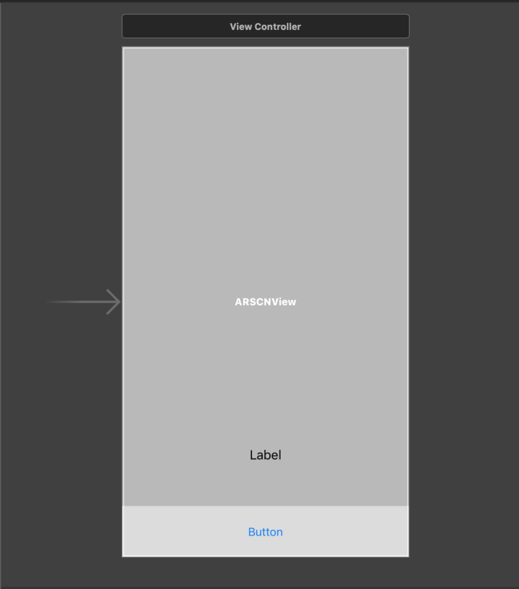

# ImageTracking

## First Tutorial

這是我的第一篇教學文章，寫得不好請多包涵。

這篇要介紹的是ARKit新的World Tracking技術，並加上Image Tracking，能在辨識出指定平面圖像後，將3D物件加入AR世界中。

## ARSession

**ARSession**是**ARKit**中處理所有事物的程序，AR的一切都是從這邊開始。

## AR Axis
在AR的世界中有三度空間，分為**X軸**、**Y軸**、**Z軸**。  
**X軸**代表的是物件在AR世界中**水平**的**左右**位置，正值為右，負值為左。  
**Y軸**代表的是物件在AR世界中**垂直**的**高度**位置，正值為高，負值為低。  
**Z軸**代表的是物件在AR世界中**深度**的**距離**位置，正值為近，負值為遠。  

### 文字很難懂的話來看張圖片吧！  


## Project

讓我們開始寫這次的App吧!  

首先創立一個SigleView專案，並在MainStoryboard加入一個**ARSCNView**。  
### =====================ARSCNView=====================

**ARSCNView**是一個將**ARKit**與**SceneKit**整合在一起，並且會自動取用相機，擷取攝像頭所拍攝的畫面。 
### ====================================================

接著再加入一個**UIButton**，還有一個**UILabel**，配置方式如圖所示。  

  

再來我們將**ARSCNView**,**UILabel**拉IBOutlet進我們的**ViewController**  
像是這樣子  
  

### 光源
在AR世界中，一定要有光源射在物件上，反射後我們才能看出物件的立體感、陰影等等...。
所以我們這邊使用一個最快速簡單的方式也就是這兩行程式碼 

``` swift
sceneView.autoenablesDefaultLighting = true
sceneView.automaticallyUpdatesLighting = true
```